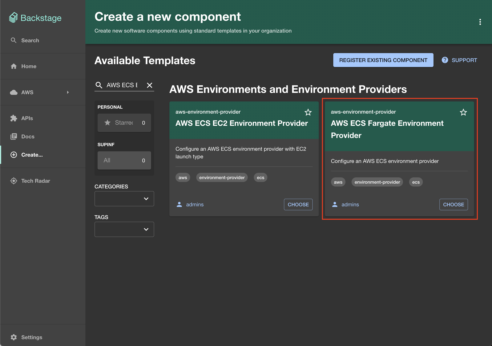
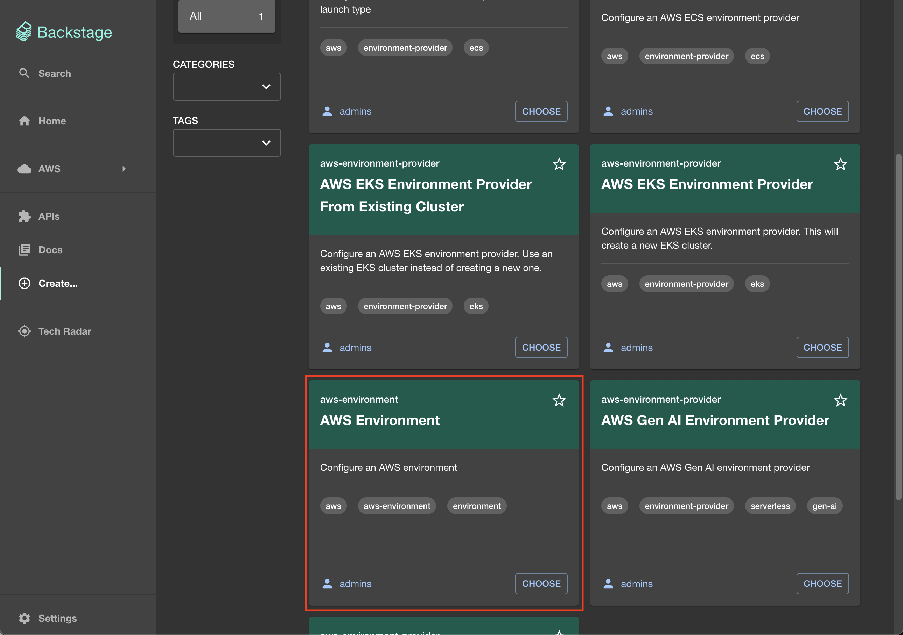
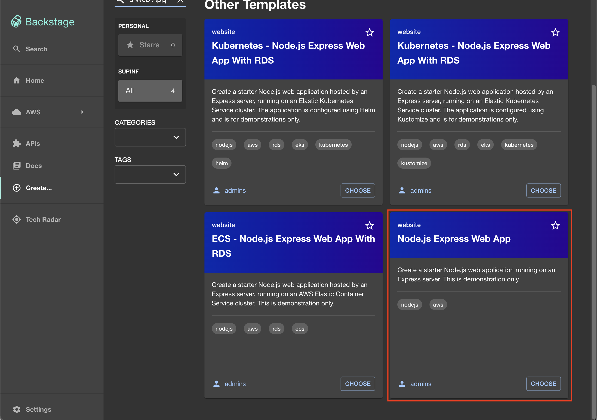

OPA(Orchestrate Platforms and Applications) on AWS
---

This tool Dockerizes [OPA(Orchestrate Platforms and Applications) on AWS](https://opaonaws.io/) for easier management and deployment.

## Description

This tool provides a Dockerfile that meets the prerequisites listed in the [Installation guide for OPA on AWS](https://opaonaws.io/docs/getting-started/deploy-the-platform#prerequisites).

## Getting Started

As an example, let's create an environment to run a Node.js application on ECS Fargate.

Note: Resources will be created on AWS, and charges will be incurred.

### Prerequisites

#### AWS

1. Create an [AWS](https://aws.amazon.com/) account.
1. Create an IAM User.

    | Field | Value |
    | --- | --- |
    | User name | (input as appropriate) |
    | Permissions options | (select as appropriate) |

1. Generate Access keys for the created IAM User.
1. Subscribe to [GitLab Community Edition](https://aws.amazon.com/marketplace/pp/prodview-w6ykryurkesjq?sr=0-1&ref_=beagle&applicationId=AWS-Marketplace-Console).
1. Obtain a domain (either through Route 53 or an external service).
1. Create a public hosted zone in Route 53 for the obtained domain.

#### Okta Developer

1. Create an [Okta Developer](https://developer.okta.com/) account.
1. Create a new app integration from `Applications > Applications > Create a new app integration`.

    | Field | Value |
    | --- | --- |
    | Sign-in method | OIDC - OpenID Connect |
    | Application type | Web Application |
    | App integration name | OPA on AWS |
    | Grant type | Authorization Code & Refresh Token |
    | Sign-in redirect URIs | https://<R53_HOSTED_ZONE_NAME>/api/auth/okta/handler/frame |
    | Sign-out redirect URIs | http://<R53_HOSTED_ZONE_NAME> |
    | Controlled access | (select as appropriate) |

1. Generate a new token from `Security > API > Tokens > Create token`.

    | Field | Value |
    | --- | --- |
    | Name | OPA on AWS |

#### This Tool

1. Prepare the `.env` and `.config` files.

    First, run the following command to initialize:

    ```shell
    make init
    ```

    Next, fill in the contents of the generated `.env` file.

    | Field | Value | Description |
    | --- | --- | --- |
    | PROJECT_NAME | opaonaws | Project identifier used in Dockerfile build tags, etc |
    | BUILD_TAG | 0.0.1 | Version used in Dockerfile build tags |
    | GIT_CONFIG_USER_NAME | (input as appropriate) | Committer name to use for git commits for Backstage resources |
    | GIT_CONFIG_USER_EMAIL | (input as appropriate) | Email address used for git commits for Backstage resources |
    | AWS_DEFAULT_REGION | (input as appropriate) | AWS region used as the default for AWS CLI commands |
    | AWS_ACCESS_KEY_ID | (Access Key ID generated in the AWS section) | Access Key ID used for AWS CLI commands |
    | AWS_SECRET_ACCESS_KEY | (Secret Access Key generated in the AWS section) | Secret Access Key used for AWS CLI commands |

    Finally, fill in the contents of the generated `.config` file. Below is a brief explanation, but for more details, please refer to the contents of the `.config` file.

    | Field | Value | Description |
    | --- | --- | --- |
    | AWS_ACCOUNT_ID | (the AWS account ID created in the AWS section, obtainable with `aws sts get-caller-identity --query 'Account'`) | 12 digit AWS account ID to deploy Backstage/OPA platform resources to |
    | AWS_DEFAULT_REGION | (input as appropriate) | AWS region used as the default for AWS CLI commands |
    | GITLAB_AMI | (the AMI for GitLab from the Marketplace subscribed in the AWS section, obtainable with `aws ec2 describe-images --owners "aws-marketplace" --filters "Name=name,Values=*GitLab CE 16.8.1*" --query 'Images[].[ImageId]' --region <AWS_DEFAULT_REGION> --output text`) | The AMI for the GitLab service EC2 |
    | GITLAB_RUNNER_AMI | (the AMI for the GitLab runner from the Marketplace subscribed in the AWS section, obtainable with `aws ec2 describe-images --owners "amazon" --filters "Name=name,Values=*ubuntu-jammy-22.04-amd64-server-20230208*" --query 'Images[].[ImageId]' --region <AWS_DEFAULT_REGION> --output text`) | The AMI for the GitLab runner EC2 |
    | R53_HOSTED_ZONE_NAME | (the name of the public hosted zone created in the AWS section) | Route 53 hosted zone for the Backstage/OPA platform deployment |
    | ALLOWED_IPS | (input as appropriate) | Comma-separated list of IPv4 CIDR ranges to allow requests to Backstage/GitLab load balancers |
    | OKTA_API_TOKEN | (the token generated in the Okta Developer section) | Okta's Security API Token |
    | OKTA_AUDIENCE | (the org URL for your Okta domain) | Okta's Audience (e.g. https://dev-12345678.okta.com) |
    | OKTA_AUTH_SERVER_ID | (blank) | Okta's Auth Server ID |
    | OKTA_CLIENT_ID | (the Client ID generated in the Okta Developer section) | Okta's Applications Client ID |
    | OKTA_CLIENT_SECRET | (the Client Secret generated in the Okta Developer section) | Okta's Applications Client Secret |
    | OKTA_IDP | (blank) | Okta's IDP |
    | SECRET_GITLAB_CONFIG_PROP_apiToken | (blank) | The token to use for calling GitLab APIs |
    | CUSTOMER_NAME | (input as appropriate) | The name of the Backstage hosting organization. This will be displayed in the UI |
    | CUSTOMER_LOGO | (input as appropriate) | URL to an organization logo. This will be displayed for branding in the UI |
    | CUSTOMER_LOGO_ICON | (input as appropriate) | URL to the icon image of the hosting organization logo. This will be displayed for branding in the UI |
    | BACKSTAGE_SCAFFOLDER_NAME | (input as appropriate) | Committer name used by the Backstage scaffolder for git commits |
    | BACKSTAGE_SCAFFOLDER_EMAIL | (input as appropriate) | Email address used by the Backstage scaffolder for git commits |
    | POSTGRES_* | (input as appropriate) | Backstage database configurations for local testing |
    | SSM_GITLAB_HOSTNAME | git.<R53_HOSTED_ZONE_NAME> | The GitLab host name (e.g. git.mycompany.com) |

1. Build the Dockerfile.

    Run the following command to build the Dockerfile:

    ```shell
    make build
    ```

### Execution

#### Run the Docker Image

Run the built Docker Image with the following command:

```shell
make run
```

Once inside the container, execute the [OPA on AWS installation command](https://github.com/awslabs/app-development-for-backstage-io-on-aws/blob/main/Makefile#L13-L32) with the following command:

```shell
# This should be executed under /app/app-development-for-backstage-io-on-aws
make install
```

This will create the following resources:

| Resource | Name |
| --- | --- |
| GitLab Repository | opa-admin/backstage-reference |
| AWS CloudFormation Stack | CDKToolkit / opa-platform |

After all processes are completed, you will be able to access the following pages (you need to access them from the IP addresses specified in `ALLOWED_IPS`).

| Name | URL | Notes |
| --- | --- | --- |
| OPA on AWS (Backstage) | https://<R53_HOSTED_ZONE_NAME>/ | It may take some time for the page to become accessible |
| GitLab | https://git.<R53_HOSTED_ZONE_NAME>/admin | Username or primary email: root<br>Password: (EC2 > Instances > opa-GitlabHost > Instance ID) |

#### Create an IAM Role

Create an IAM Role with the following settings:

| Field | Value |
| --- | --- |
| Trusted entity type | Custom trust policy |
| Custom trust policy | (see below) |
| Permissions policies | (select as appropriate) |
| Role name | opa-envprovisioning-role |

```json
{
    "Version": "2012-10-17",
    "Statement": [
        {
            "Effect": "Allow",
            "Principal": {
                // Replace with the arn of the created resource
                "AWS": "arn:aws:iam::001648768719:role/opa-platform-GitlabRunnerConstructGitlabRunnerIamRo-XXXXXXXXXXXX"
            },
            "Action": "sts:AssumeRole"
        }
    ]
}
```

#### Create Resources with OPA on AWS (Backstage)

1. Create an Environment Provider

    From the OPA on AWS (Backstage) menu, select Create and choose `AWS ECS Fargate Environment Provider`.

    

    Fill in the displayed form with the following information:

    | Field | Value |
    | --- | --- |
    | Name | ecs-dev-provider |
    | Prefix | ecsdev |
    | Description | A Dev environment provider for containerized applications |
    | AWS Account number | <AWS_ACCOUNT_ID> |
    | AWS Region | (input as appropriate) |
    | Environment Role ARN | arn:aws:iam::<AWS_ACCOUNT_ID>:role/opa-envprovisioning-role |
    | VPC Configuration | Create New VPC |
    | CIDR | 10.0.0.0/24 |
    | Repository | ecs-dev-provider |

    Once the process is complete, the following resources will be created:

    | Resource | Name |
    | --- | --- |
    | GitLab Repository | aws-environment-providers/ecs-dev-provider |
    | AWS CloudFormation Stack | ECS-ENV-ecsdev-ecs-dev-provider-Stack |

2. Create an Environment

    From the OPA on AWS (Backstage) menu, select Create and choose `AWS Environment`.

    

    Fill in the displayed form with the following information:

    | Field | Value |
    | --- | --- |
    | Name | ecs-dev |
    | Short Name | ecsdev |
    | Description | Development environment for containerized applications deployed to ECS |
    | Select the environment type | AWS ECS |
    | Deployment Requires Approval | No |
    | Account Type | Single-account |
    | Region Type | Single-region |
    | Category | Development |
    | Classification | public |
    | System | demo |
    | Hierarchy of the Environment | 1 |
    | Repository | ecs-dev |

    Once the process is complete, the following resources will be created:

    | Resource | Name |
    | --- | --- |
    | GitLab Repository | aws-environments/ecs-dev |

3. Create Apps

    From the OPA on AWS (Backstage) menu, select Create and choose `Node.js Express Web App`.

    

    Fill in the displayed form with the following information:

    | Field | Value |
    | --- | --- |
    | Name | demo-app |
    | Description | Node.js demo application running on ECS |
    | Repository | demo-app |

    Once the process is complete, the following resources will be created:

    | Resource | Name |
    | --- | --- |
    | GitLab Repository | aws-app/demo-app |
    | AWS CloudFormation Stack | demo-app-ecs-resources-ecs-dev-provider |

4. Show the Web App

    From the OPA on AWS (Backstage) menu, select `AWS > Apps > demo-app`.

    By default, the Application State will be `No Task Running`, so click `START TASK` to run the task.
    <div style="text-align: center;">
      
    </div>

    Once the task is `RUNNING`, you can access the application from the `Go to app` link in Links.
    <div style="text-align: center;">
      
    </div>

    If the following page is displayed, building the application is a success.
    <div style="text-align: center;">
      
    </div>

### Troubleshooting

1. Compilation Error during `make install`

    When running `make install` inside the container, the process may stop with an error like the following:

    ```shell
    $ tsc
    packages/backend/src/plugins/scaffolder.ts:20:5 - error TS2322: Type 'PermissionEvaluator' is not assignable to type 'PermissionsService'.
      Types of property 'authorize' are incompatible.
        Type '(requests: AuthorizePermissionRequest[], options?: EvaluatorRequestOptions | undefined) => Promise<DefinitivePolicyDecision[]>' is not assignable to type '(requests: AuthorizePermissionRequest[], options: PermissionsServiceRequestOptions) => Promise<DefinitivePolicyDecision[]>'.
          Types of parameters 'options' and 'options' are incompatible.
            Type 'PermissionsServiceRequestOptions' has no properties in common with type 'EvaluatorRequestOptions'.

    20     permissions: env.permissions,
          ~~~~~~~~~~~

      node_modules/@backstage/plugin-scaffolder-backend/dist/index.d.ts:762:5
        762     permissions?: PermissionsService;
                ~~~~~~~~~~~
        The expected type comes from property 'permissions' which is declared here on type 'RouterOptions'


    Found 1 error in packages/backend/src/plugins/scaffolder.ts:20

    info Visit https://yarnpkg.com/en/docs/cli/run for documentation about this command.
      executing     yarn tsc ✖ 

    Error: Could not execute command yarn tsc

    It seems that something went wrong when creating the app 🤔

    🔥  Failed to create app!

    make[1]: *** [Makefile:76: backstage-install] Error 1
    make[1]: Leaving directory '/app/app-development-for-backstage-io-on-aws'
    make: *** [Makefile:17: install] Error 2
    ```

    Although the cause of this error has not been identified, simply running `make install` again will allow the process to continue past this error and create the resources successfully.

1. Error when Assigning Elastic IPs

    If you encounter the following error when assigning Elastic IPs:

    ```
    The maximum number of addresses has been reached.
    ```

    This error is due to reaching the limit for the number of Elastic IPs that can be allocated. To resolve this, request a quota increase from `AWS Service Quotas > AWS services > Amazon Elastic Compute Cloud (Amazon EC2) > EC2-VPC Elastic IPs`.
